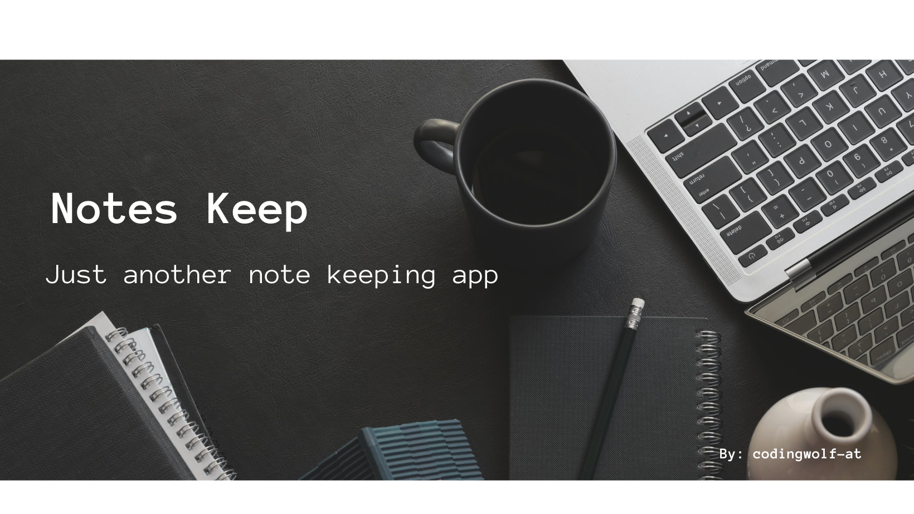

# Notes Keep 💡

 

> Work in progress ⚒️
<!-- https://notes-keep-v1.netlify.app/ -->
## Current features

- Add Notes
- Delete Notes
- Timestamp on Notes
- Change Dark/Light Mode
- Notes & Theme getting saved in localStorage for now

## To be implemented in next iteration

- Trash Bin
- Note categories (IMP, Reminder, Notification, etc)
- Routes using React Router v6
- Edit notes
